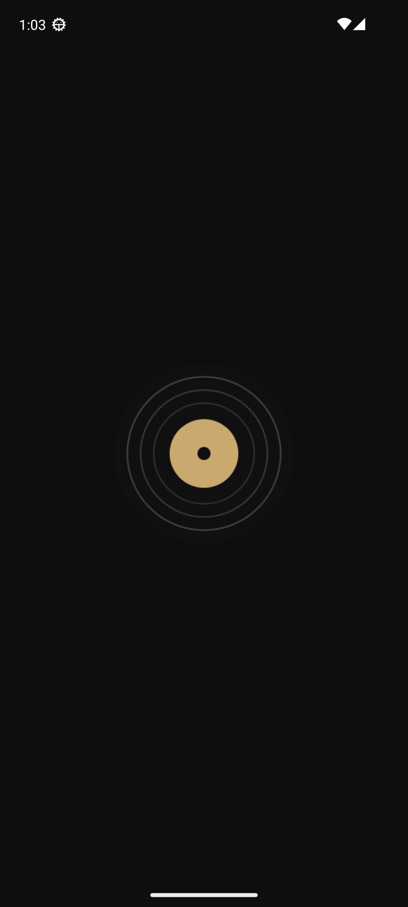
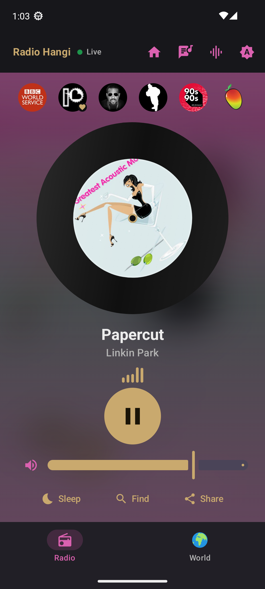
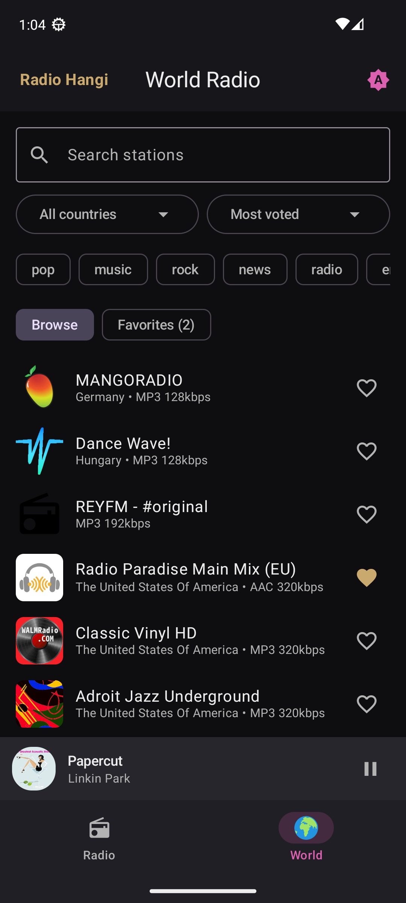
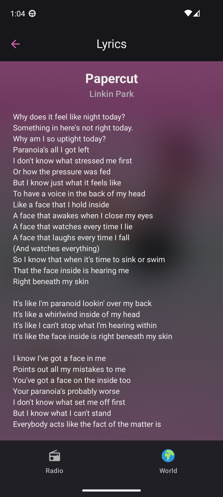
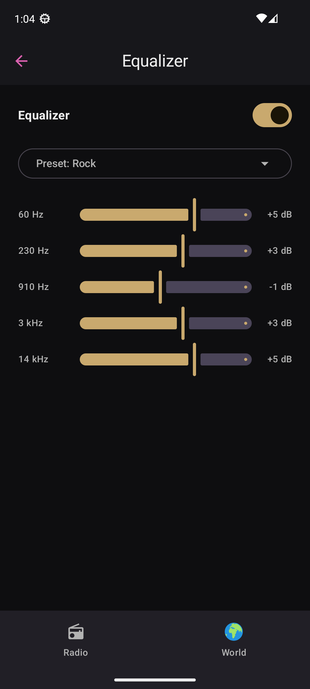

# Radio Hangi

A native Android radio app built with Jetpack Compose and Media3. It streams the **Radio Hangi** home station with live now‑playing metadata, album art and lyrics, and also lets you browse and play thousands of **World Radio** stations — all wrapped in a vinyl‑record themed UI.

<table>
  <tr>
    <td align="center"><br/><sub>Vinyl splash</sub></td>
    <td align="center"><br/><sub>Home stream + now playing</sub></td>
    <td align="center"><br/><sub>World Radio + mini-player</sub></td>
    <td align="center"><br/><sub>Lyrics</sub></td>
    <td align="center"><br/><sub>Equalizer</sub></td>
  </tr>
</table>

> Screenshots captured on a Pixel 6 (Android 13) emulator.

## Features

- **Live home radio** — streams the Zeno home mount and shows the current song via Server‑Sent Events, with the album art spinning on a vinyl disc.
- **Album art & lyrics** — covers resolved from Deezer, full lyrics from lyrics.ovh on a dedicated lyrics page.
- **World Radio** — search the [Radio Browser](https://www.radio-browser.info/) directory by name, country and genre; sort, browse and play any station.
- **Favorites & recents** — star stations and quick‑play them from a compact row on the home screen; persisted with DataStore.
- **Persistent mini‑player** — keeps now‑playing controls visible while you browse other tabs.
- **Background playback** — Media3 `MediaSessionService` with a media notification, lock‑screen / Bluetooth / Android Auto controls, and audio‑focus handling.
- **Home‑screen widget** — a Glance widget showing the current track with play/pause and quick‑play favorites.
- **Extras** — sleep timer, share the current song, volume/mute, light/dark/system theme toggle, vinyl‑record splash screen, and double‑back‑to‑exit (which also stops playback).

## Tech stack

| Area | Library |
| --- | --- |
| UI | Jetpack Compose (BOM 2026.02.01), Material 3, Navigation‑Compose |
| Playback | Media3 ExoPlayer + MediaSessionService (HLS support) |
| Networking | Retrofit + OkHttp (incl. SSE), kotlinx.serialization |
| Images | Coil 3 |
| Persistence | Preferences DataStore |
| Widget | Jetpack Glance |
| Splash | AndroidX Core SplashScreen |

Architecture is single‑activity **MVVM**: a `data/` layer (remote APIs + repositories), a `domain/model/` layer, and a Compose `ui/` layer driven by `StateFlow`s, with a shared `player/` module bridging the UI to the playback service.

## Data sources

- **Zeno.FM** — home‑stream audio + now‑playing metadata (SSE)
- **Deezer** — album cover art
- **lyrics.ovh** — song lyrics
- **Radio Browser** — the World Radio station directory

## Build

Requirements: a recent Android Studio / JDK 11+ and the Android SDK.

```bash
# Debug APK
./gradlew :app:assembleDebug

# Install on a connected device / emulator
./gradlew :app:installDebug
```

- Application id: `com.canka.dev.radiohangi`
- `minSdk` 24, `targetSdk` 36

> `local.properties` (your SDK path) is intentionally not committed — Android Studio recreates it on first open.

## License

Personal project. All third‑party station data and artwork belong to their respective providers.
